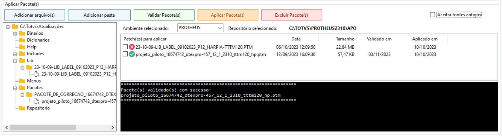

<h3 align="center">Compilação por linha de comando</h3>

Principais características:

- Não tem comunicação cliente/server TCP, os comandos são executados diretamente no AppServer.
- Ambiente simples que necessita apenas do appre, binário do appserver e arquivo de configuração "appserver.ini".
- Compilação mais rápida.
- Suporte a atual chave de compilação utilizada pelo TDS e TDSCli.
- Chave de compilação para Linux utilizando criptografia AES 256bits.
- Compatível com Sistemas Operacionais Windows e Linux.

<h3 align="left">Validando um patch</h3>

Exemplo: 
<pre>
c:\totvs\protheus\bin\appserver\appserver.exe <b>-compile</b> <b>-validatepatch</b> <b>-outreport</b> -env=<b>NomeAmbiente</b> -files=<b>c:\totvs\atualizacoes\projeto_piloto_16674742_dtexpro-457_12_1_2310_tttm120_hp.ptm</b>
  </pre>

Parametros:
<pre>
-compile	Necessário para inicialização da ferramenta
-validatePatch	Indica Validação de Patch
-outreport	Gera os arquivos compile_sucess.log, que contem a lista de fontes compilados com sucesso no formato do arquivo .lst, e compile_errors.log, que contem a lista de fontes não compilados e os erros de compilação. 
-env	        Informa o ambiente que deverá ser acessado para compilação.
-files          Informa o patch a ser aplicado com extensão  ("PTM", "UPD" E "PAK").
</pre>

<h3 align="left">Aplicação de Patch</h3>

Exemplo:
<pre>
c:\totvs\protheus\bin\appserver\appserver.exe <b>-compile</b> <b>-applypatch</b> <b>-outreport</b> -env=<b>NomeAmbiente</b> -files=<b>c:\totvs\atualizacoes\projeto_piloto_16674742_dtexpro-457_12_1_2310_tttm120_hp.ptm</b>
</pre>

Parametros:
<pre>
-compile	  Necessário para inicialização da ferramenta
-applypatch	  Indica aplicação de Patch
-outreport	  Gera os arquivos compile_sucess.log, que contem a lista de fontes compilados com sucesso no formato do arquivo .lst, e compile_errors.log, que contem a lista de fontes não compilados e os erros de compilação. 
-env	          Informa o ambiente que deverá ser acessado para compilação.
-files            Informa o patch a ser aplicado com extensão  ("PTM", "UPD" E "PAK").
-applyoldprogram  Informa que serão aceitos fontes mais antigos que o RPO. Por default, aceita somente os fontes mais novos.
</pre>

